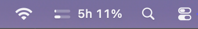
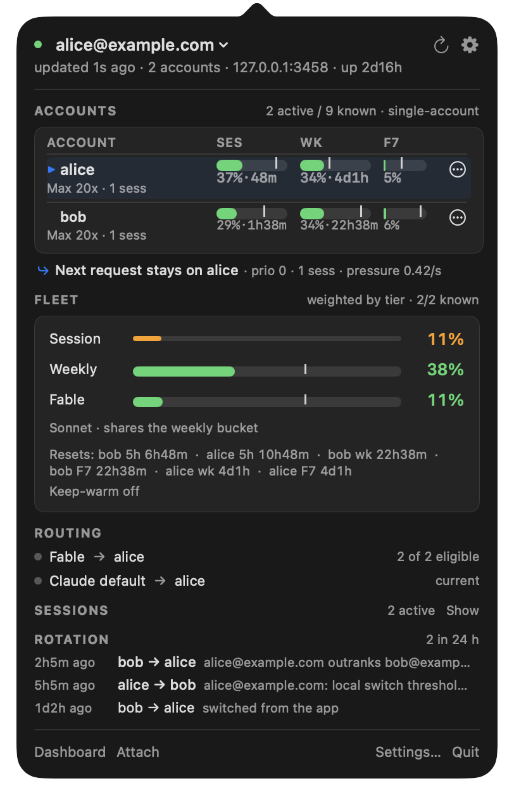
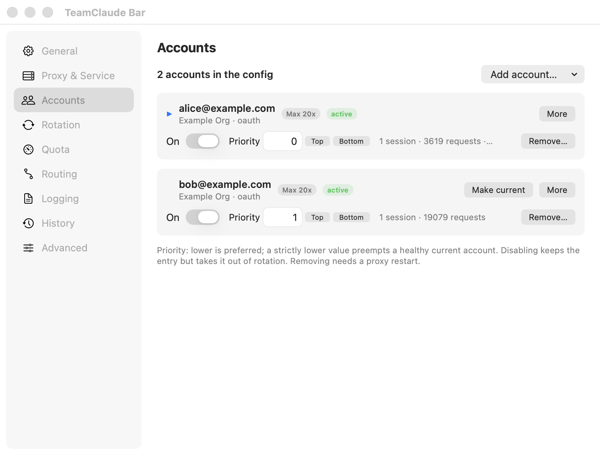
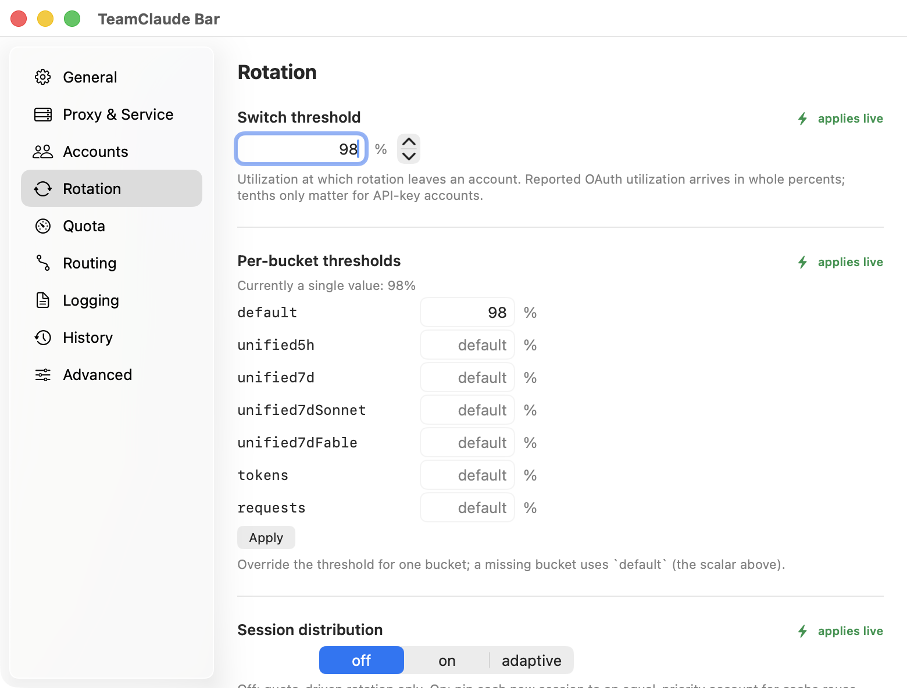
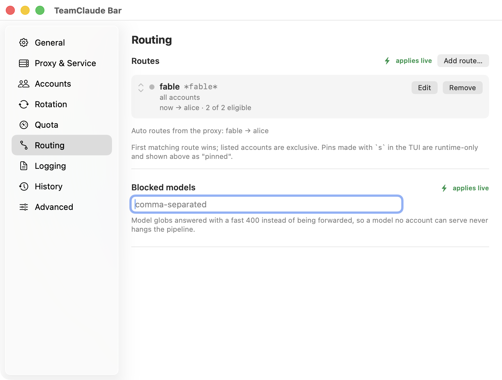
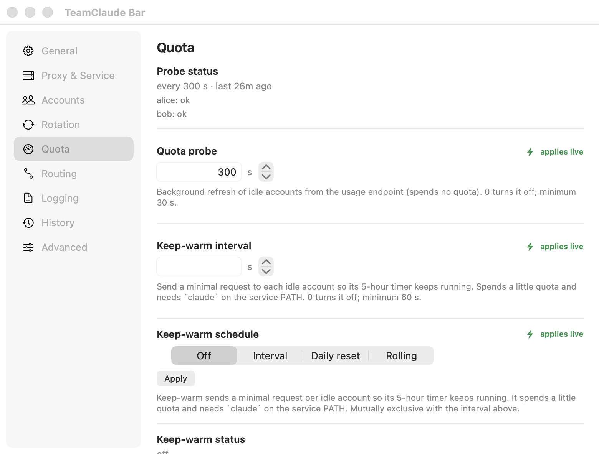
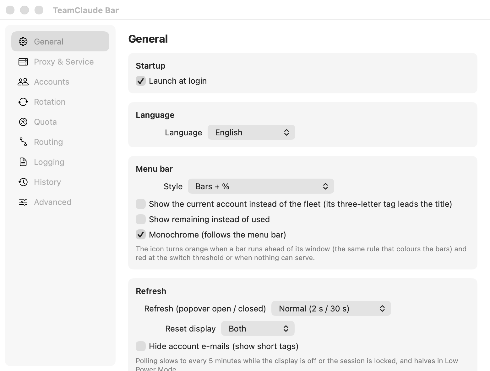

<p align="center">
  
</p>
<h1 align="center">TeamClaude Bar</h1>
<p align="center">
  Your Claude accounts, their quota and where the next request goes, one click from the menu bar.<br>
  A native macOS client for the <a href="../README.md">teamclaude</a> proxy.
</p>
<p align="center">
  
  
  
  
  <a href="../LICENSE"></a>
</p>

<p align="center">
  
</p>
<p align="center">
  
</p>

The proxy already rotates your Claude subscriptions for you. TeamClaude Bar puts that
state where you can glance at it: a `5h 42%` in the menu bar that never gets mistaken
for the battery, a popover with every account's session and weekly bars, the account
the next request will land on and why, and a settings window that edits every
documented proxy setting without opening a terminal.

## Install

Requirements: macOS 14 Sonoma or later, a teamclaude proxy on this Mac (1.1.18 or
newer shows everything; older versions work with an estimate banner), and the Swift 6
toolchain from Xcode 16 or the Command Line Tools to build.

```sh
git clone https://github.com/KarpelesLab/teamclaude
cd teamclaude
make -C macos install        # builds dist/TeamClaude Bar.app and copies it to /Applications
open "/Applications/TeamClaude Bar.app"
```

The bundle is ad-hoc signed, not notarized, so the first launch of a fresh build needs a
right-click → **Open** once. There is nothing to configure: the app reads the same
`~/.config/teamclaude.json` the proxy uses (or `TEAMCLAUDE_CONFIG` from the
LaunchAgent) and dials the port in it. Turn on **Launch at login** in Settings → General.

## What you get

- **A menu bar item that reads as usage.** `5h 42%` is the fleet's 5-hour window; the
  bars under it are 5-hour and weekly. It turns orange when a bar runs ahead of its
  window, red at the switch threshold or when nothing can serve, flashes `→ bob` on a
  rotation, and greys out with a `—` when the proxy is gone. Five styles, monochrome or
  coloured, fleet or the pinned account.
- **Every account at a glance.** Session, weekly and per-family (Fable, Sonnet) bars
  with the number and reset under each, tier, priority, throttle countdowns, the
  sessions pinned to it, and a row menu: make current, enable, priority, remove.
- **Where the next request goes, and why.** The server's own answer (`defaultTarget`)
  explained: the old account's reason, a better priority, expiry routing or the
  adaptive scorer's line. On a mixed Claude + Codex fleet, one line per provider.
- **Fleet totals, reset timeline, routes, sessions.** Tier-weighted aggregates coloured
  by the same pace rule as the account bars; every coming window reset with `↑` on the
  ones that bring an account back; model routes with their eligible set; which Claude
  Code session is pinned where and which one is starving.
- **Switch from anywhere.** The account menu in the popover, the right-click menu, or
  `⌃⌥⌘N` for the next account that can serve. `⌃⌥⌘T` opens the popover.
- **Every setting, with the right warning.** Rotation thresholds (per bucket too),
  session distribution, expiry routing, storm control, quota probe, keep-warm
  schedules, routes and blocked models, logging, client keys, usage dimensions, the
  network knobs. Each control says whether it applies live or needs a proxy restart,
  and the restart bar at the bottom does it for you.
- **Account sheets.** Browser sign-in, paste-the-code sign-in, API key, Codex, import
  from Claude Code or a credentials file, all streamed from the CLI into the sheet.
- **Service health, diagnosed.** The LaunchAgent's state, crash loops, and the classic
  "another teamclaude holds the port" case, with the one-click fix. Restart, reinstall,
  open the log, export diagnostics with every secret redacted.
- **Notifications that mean something.** Fleet thresholds, a rotation with its reason,
  an account leaving or re-entering rotation, a re-login needed, the probe failing, a
  hold, the proxy going away and coming back, overage billing. Pause them for an hour.
- **Seven days of history.** A sample a minute while the app runs: fleet sparklines and
  a state strip per account, kept locally.
- **Speaks your language.** English, 한국어, 日本語, 简体中文, Español, Deutsch,
  Français, following the Mac's language list and switchable in place.

## Gallery

#### Accounts


#### Rotation


#### Routing


#### Quota


#### General


## The menu bar item

| Title | Meaning |
| --- | --- |
| `5h 42%` | Fleet 5-hour usage. The bars below are 5-hour (top) and weekly (bottom). |
| `ali 5h 42%` | Pinned to the current account (Settings → General): its three-letter tag leads. |
| `5h 42% · 7d 61%` | The *Bars + 5h · 7d* style. |
| `5h 93%!` | Critical: at the switch threshold, the current account cannot serve and nothing else can, or every account is out. |
| `→ bob` | A rotation just happened; shown for six seconds. |
| `—` | The proxy is not reachable. |
| `5h 0%` | The proxy runs but has no accounts. |

Orange means a bar is ahead of its window (the TUI's pace rule); red is the switch
threshold or a fleet that cannot serve. *Quiet* style shows no text until there is a
warning. Hover for the tooltip: current account, 5h / 7d / Fable, next reset, how many
accounts can serve.

## Shortcuts

| Keys | Where | Does |
| --- | --- | --- |
| `⌃⌥⌘N` | anywhere | Switch to the next account that can serve |
| `⌃⌥⌘T` | anywhere | Show or hide the popover |
| `⌘R` `⌘D` `⌘T` `⌘,` `⌘Q` | popover | Refresh · Dashboard · Attach in Terminal · Settings · Quit |
| right-click the item | menu bar | Switch, refresh, reload config, dashboard, attach, log, pause notifications |

Both global shortcuts can be turned off in Settings → General. No Accessibility
permission is needed.

## What applies live and what needs a restart

The app goes through the CLI where a command exists (`threshold`, `probe`, `warmup`,
`distribute`, `priority`, `enable`/`disable`, `route add`/`rm`, `login`, `import`,
`remove`) and edits the config file atomically otherwise, then asks the proxy to reload.
Fields the proxy only reads at startup (port, host, logging, hold seconds, storm ramp,
adaptive tuning, upstream, auto-update, removing an account) show a **restart** tag and
queue up in the bar at the bottom of the settings window. The full table is in
[docs/menubar.md](../docs/menubar.md#what-applies-live-and-what-needs-a-restart).

## Privacy and security

- Talks only to the proxy's control plane (`/teamclaude/status`, `/quota`, `/switch`,
  `/reload`) on the host and port in the config, with the proxy key as `x-api-key`. No
  other network access, no telemetry.
- Never reads or writes tokens. Config edits are a same-directory temp file, fsynced,
  `0600`, renamed over the target, under the same advisory lock the proxy uses.
- Secrets never reach the command line: an API key goes to the CLI on stdin, the raw
  JSON editor shows them as `•••` and puts them back on save, and the diagnostics
  export replaces every one of them.
- "Hide account e-mails" swaps names for short tags across the whole UI (Settings →
  General).

## Development

```sh
cd macos
swift build                  # debug build
swift test                   # unit tests plus a live headless proxy started from ../src
make app                     # dist/TeamClaude Bar.app, ad-hoc signed
make snapshots               # PNGs of the popover and every pane, against a throwaway proxy
TEAMCLAUDE_CONFIG="$(scripts/demo-config.sh 3458)" swift run TeamClaudeBar   # with scripts/demo-server.mjs on :3458
```

The package has two targets: `TeamClaudeCore` (Foundation only, everything the tests
cover: decoding, derivations, the alert engine, the icon model, config editing, the CLI
runner, localization) and `TeamClaudeBar` (AppKit and SwiftUI). No third-party
dependencies. `test/macos-fixtures.test.js` on the Node side keeps the Swift fixtures
honest against the proxy: a new status field fails there, naming the key.

`scripts/demo-server.mjs` answers the control plane from the test fixtures with the
clocks shifted to now, so the UI can be worked on, and photographed, with example.com
accounts. Strings live in `Sources/TeamClaudeCore/Resources/<lang>.lproj/Localizable.strings`,
keyed by the English text; a test fails if a string in the sources has no row there.

Screenshots are taken with `TEAMCLAUDE_BAR_DEBUG_WINDOW=<section>` (opens that settings
pane and the popover and logs their window numbers for `screencapture -l`) and
`TEAMCLAUDE_BAR_DEBUG_APPEARANCE=light|dark`.

## FAQ

**The item is not in my menu bar.** A full menu bar hides the newest items; make room
or use a menu bar manager. The item sits next to the system items and remembers its
position.

**"Proxy not reachable".** The app dials the port in the config. Start the proxy
(`teamclaude service install`, or `teamclaude server` in a terminal) or fix
`proxy.port`. Settings → Proxy & Service shows what launchd thinks and who holds the port.

**"Proxy older than 1.1.18".** Routing targets are then estimated from the current
account. `teamclaude update` clears it.

**Why macOS 14?** The app is built on Observation and the current SwiftUI menu and
settings APIs; going lower would mean a second implementation of the state layer.

**Is it in the App Store, or notarized?** No. It is part of the teamclaude repository
and built from source, like the proxy itself. The only canonical sources are this
repository and the npm package; see [SECURITY.md](../SECURITY.md).

## License

MIT, like teamclaude.
